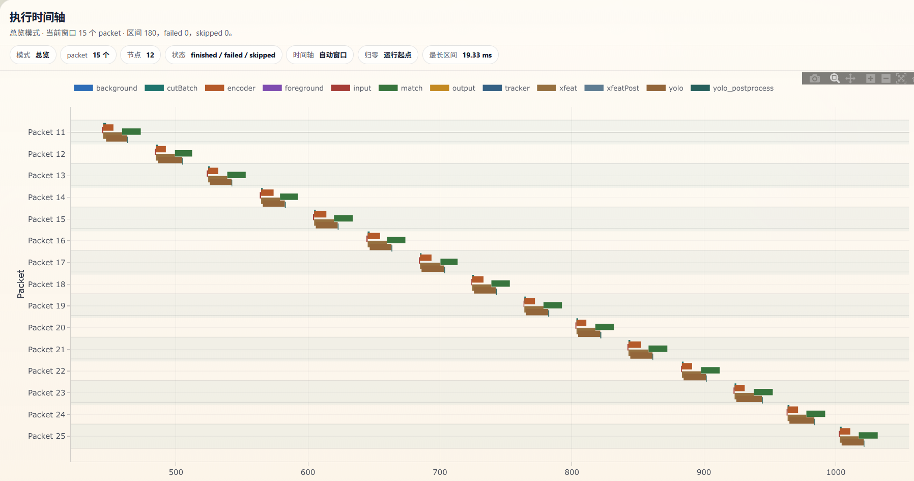
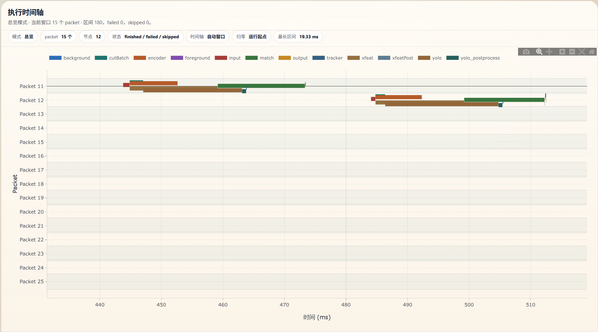

# GryFlux-Ascend-JODLT

**基于 GryFlux 异步 DAG 框架和昇腾 Ascend ACL 的 JODLT 实时视觉处理流水线**

GryFlux-Ascend-JODLT 是当前项目中的 JODLT 应用实现。它在 GryFlux 的事件驱动异步 DAG 调度框架之上，集成 Ascend ACL 推理资源、OpenCV 图像处理、多目标检测跟踪、XFeat 特征匹配、单应矩阵估计以及前景/背景码流提取，面向嵌入式 AI 设备上的实时图像序列处理。

在GryFlux的框架基础上实现了主机/设备内存池、AclRuntime资源管理、通用模型推理资源上下文管理等组件。

原框架：https://github.com/Grifcc/GryFlux

---

## ✨ 核心特性

- 🚀 **异步 DAG 调度** - 基于 GryFlux `GraphTemplate` 和 `AsyncPipeline` 组织多分支视觉流水线
- 💎 **Ascend 推理资源池** - 通过 `ResourcePool` 和 `AclResourceBuilder` 管理 YOLO、XFeat、匹配与编码模型资源
- 🌊 **流式图像输入** - `ImgDataSource` 从目录读取图像序列并持续产生 `Packet`
- 🎯 **关键帧/GOP 机制** - 每 `gop_frame` 帧标记关键帧，支持前景和背景差异化提取
- 🔍 **检测与跟踪融合** - YOLO 后处理结合 ByteTrack 输出稳定目标轨迹
- 🧭 **特征匹配与运动估计** - XFeat 特征和匹配节点输出帧间单应矩阵
- 🧩 **前景/背景分离** - 根据目标框、单应矩阵和编码结果提取重点区域与背景数据
- 📊 **可选图级 Profiling** - 编译期开启 `GRYFLUX_BUILD_PROFILING` 后可记录节点耗时和时间线

---

## 🏗️ 架构概览

### 整体流水线

```
┌────────────────────────────────────────────────────────────────────────────┐
│                              AsyncPipeline                                 │
│                                                                            │
│  ImgDataSource ──> GraphTemplate / AsyncGraphProcessor ──> ResultConsumer  │
│                         │                                                  │
│                         ▼                                                  │
│                  ResourcePool + ACL Context                                │
└────────────────────────────────────────────────────────────────────────────┘
```

### 当前 JODLT DAG

`src/app/ascend/test_dag.cpp` 中构建的 JODLT 图模板如下：

```
input
  ├─> cutBatch ──> yolo ──> yolo_postprocess ──> tracker ┐
  ├─> xfeat ──> match ──> xfeatPost ─────────────────────┼─> foreground ┐
  └─> encoder ────────────────────────────────────────────┘              │
                                                                          ├─> output
                         tracker + xfeatPost + encoder ──> background ───┘
```

说明：

- `input` 负责从原始图像生成后续节点需要的 HostBuffer 和灰度图。
- `cutBatch` 将输入裁剪/组织为 YOLO 批量推理输入。
- `yolo` 使用 Ascend OM 模型执行目标检测。
- `yolo_postprocess` 对检测输出做后处理和 NMS。
- `tracker` 基于检测结果执行目标跟踪，当前使用 ByteTrack 相关实现。
- `xfeat` 执行特征提取推理。
- `match` 执行特征匹配推理。
- `xfeatPost` 根据匹配结果生成单应矩阵。
- `encoder` 对灰度图执行编码推理，输出下采样编码图。
- `foreground` 根据目标框、单应矩阵和编码图提取前景数据。
- `background` 根据关键帧模式和单应矩阵提取背景数据。
- `output` 汇总前景和背景结果，交给 `ResultConsumer` 消费。

---

## 📦 目录结构

```
GryFlux-Ascend-JODLT/
├── include/                    # GryFlux 框架核心头文件
├── src/framework/              # 异步图调度、管道、资源池、Profiler 实现
├── src/utils/                  # 日志等通用工具
├── src/app/ascend/             # 当前 JODLT Ascend 应用
│   ├── test_dag.cpp            # JODLT 主程序和 DAG 构建入口
│   ├── packet/Packet.h         # 流水线数据包定义
│   ├── nodes/                  # 输入、推理、后处理、跟踪、前景/背景节点
│   ├── resources/MemoryPool.h  # Host/Device 内存池
│   ├── source/imgSource.h      # 图像数据源
│   ├── consumer.h              # 结果消费与发送逻辑
│   └── utils/                  # ACL、UDP、YOLO 后处理、ByteTrack 等工具
├── models/                     # Ascend OM 模型文件
├── docs/                       # GryFlux 框架文档和性能图
├── build.sh                    # 本机 Release 构建脚本
└── README.md                   # GryFlux 框架通用说明
```

---

## 🧠 核心组件

### 1. Packet - JODLT 数据包

`Packet` 是每一帧图像在 DAG 中流动的数据载体，继承自 `GryFlux::DataPacket`。

主要字段包括：

- `raw_image`：原始图像数据
- `gray_image`：灰度图数据，供 XFeat 和 encoder 使用
- `yolo_input` / `yolo_output`：YOLO 输入和输出缓冲区
- `xfeat_output` / `match_output`：特征提取与匹配结果
- `encoder_output`：编码模型输出
- `homography_`：帧间单应矩阵
- `object_info_`：检测和跟踪后的目标信息
- `foreground_` / `background_`：最终前景和背景码流片段
- `key_frame_`：是否为关键帧

设计上，每个并行节点写入相对独立的字段，减少数据竞争风险。

### 2. inferContext - 推理上下文

将推理的数据拷贝和acl模型推理逻辑封装到一起，所有的模型的推理统一用推理上下文，输入输出统一为vector<HostBuffer>

### 3. ResourcePool - Ascend 资源管理

当前 JODLT 使用 `AclResourceBuilder` 注册 Ascend 推理资源：

每类资源由 GryFlux 统一调度，节点只需要声明自己依赖的资源类型，例如 `builder->addTask<InferNode>("yolo", "yolo", ...)`。

### 4. AsyncPipeline - 流式执行

主程序创建如下管道：

```cpp
GryFlux::AsyncPipeline pipeline(
    source,
    graphTemplate,
    resourcePool,
    consumer,
    kThreadPoolSize,
    kMaxActivePackets
);
```

当前配置：

- `kThreadPoolSize = 24`
- `kMaxActivePackets = 4`
- `gop_frame = 30`
- `img_width = 1280`
- `img_height = 1080`
- `downsample_ratio = 8`
- `is_key_frame_mode = true`

---


## 当前的性能分析：




26个packet平均4.74ms，最长区间19.33ms
模型推理和数据搬移总耗时：
yolo总耗时256.9ms，平均17.13ms
xfeat总耗时218.4ms，平均14.56ms
match总耗时209.2ms，平均13.94ms
encoder总耗时124.6ms，平均8.30ms

---

## 🔍 调试和日志

主程序中默认日志级别为 `INFO`：

```cpp
LOG.setLevel(GryFlux::LogLevel::INFO);
LOG.setOutputType(GryFlux::LogOutputType::CONSOLE);
LOG.setAppName("JODLT");
```

调试节点内部数据流时，可改为：

```cpp
LOG.setLevel(GryFlux::LogLevel::DEBUG);
```

常见检查点：

- Ascend Runtime 是否初始化成功
- OM 模型路径是否存在且和设备匹配
- `/root/workspace/hjw/data` 是否有可由 OpenCV 读取的图片
- `Packet` 中关键缓冲区是否为空
- `foreground` / `background` 是否因目标框、单应矩阵或编码输出不足而提前返回

---

## 📐 设计原则

### 1. 图结构表达业务流程

JODLT 将检测跟踪、特征匹配、编码和前景/背景提取拆成 DAG 节点。节点依赖由 `TemplateBuilder` 显式声明，框架负责识别并行分支和调度顺序。

### 2. 推理资源与 CPU 节点分离

Ascend 推理节点通过资源名绑定到 `ResourcePool`，CPU 后处理节点不占用有限硬件资源。这样可以避免手动管理设备上下文和并发冲突。

### 3. 数据包字段分区

并行节点尽量写入不同字段。例如 YOLO 分支写入检测结果，XFeat 分支写入匹配/单应矩阵，encoder 分支写入编码结果，最后由 `foreground` 和 `background` 融合这些结果。

### 4. 面向实时流处理

`AsyncPipeline` 通过 `kMaxActivePackets` 做背压控制，避免输入过快导致内存无限增长。关键帧/GOP 机制则降低背景传输频率，适配实时传输场景。

---

## 🧭 当前状态说明

这份文档描述的是当前目录下 `GryFlux-Ascend-JODLT` 的 JODLT 实现，而不是上游 GryFlux 框架的通用示例。若修改模型路径、输入目录、网络发送方式或 DAG 拓扑，请优先同步：

- `src/app/ascend/test_dag.cpp`
- `src/app/ascend/packet/Packet.h`
- `src/app/ascend/nodes/`
- `models/`

---

## 📄 许可证

沿用项目原有版权和许可证声明。
